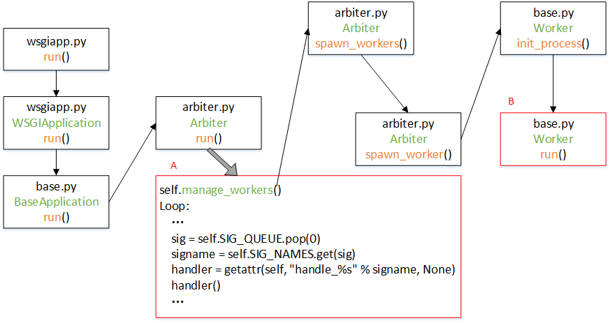

# Gunicorn 源码分析

> [Gunicorn源码分析](https://juejin.cn/post/7081581341631840286)

### 项目结构
```
├── app             # Gunicorn的运行实例,由该示例来运行arbiter，但在重启或者重新加载配置时，会由arbiter重新运行一个新的app实例
├── http            # 用于Worker中处理客户端发送的HTTP请求
├── instrument      # 使用statsd协议把自身信息发送到Statsd服务
├── workers         # Pre-Worker模型中的Worker， 负责运行Web应用， 这些worker大部分都是基于WSGI协议封装的，但可以通过自定义协议封装来支持TCP传输
├── __init__.py
├── __main__.py
├── arbiter.py      # Pre-Worker模型中的Master， 负责管理Worker, 配置重载，重新启动新的进程等。 
├── config.py       # 加载配置相关
├── debug.py        # 基于sys.settrace钩子实现的debug信息输出 
├── errors.py       # Master错误的封装
├── glogging.py     # 日志输出
├── pidfile.py      # 进程PID文件管理 
├── reloader.py     # 文件自动重载功能
├── sock.py         # 对不同类型的socket做统一的封装
├── systemd.py      # 激活systemd的socket，通过systemd文档即可知道如何交互，所以不做分析
└── util.py         # 常用代码封装
```

### Gunicorn整体运行过程说明


1. app/wsgiapp.py中的run()函数是项目的启动入口，该函数会调用app/wsgiapp.py中`WSGIApplication.run()`方法， 毕竟Gunicorn是个WSGI应用服务器；

2. WSGIApplication类的run()方法继承自app/base.py中BaseApplication类， 该BaseApplication类还有其它的子类，如：DjangoApplication、PasterBaseApplication等。 所以将run()定义在BaseApplication这个父类中。`BaseApplication.run()`方法会调用arbiter.py中`Arbiter.run()`方法。

3. 前面已经提到过， Gunicorn基于`prefork`模式，通过主进程来fork出工作者进程，然后由工作者进程取处理请求。而这里的`arbiter`("仲裁者"的意思)， 就是指主进程。`Arbiter.run()`的主要代码结构如A框中所示。首先， `arbiter(主进程)`会先根据配置调用`spawn_workers()`方法去创建指定数量(默认是1)的工作者进程数量，然后进入一个while True的循环， 在这个循环里面， 主进程接收信号，并根据信号来管理工作者进程， 所以：主进程是不直接处理用户的HTTP请求的。

4. `spawn_workers()`方法会通过循环来调用`spawn_worker()`方法， 从而创建多个工作者进程。

5. `spawn_worker()`方法中， 会通过查看配置，来生成指定类型的工作者进程，如：
    ```
    worker = self.worker_class(self.worker_age, self.pid, self.LISTENERS, self.app, self.timeout / 2.0, self.cfg, self.log)
    ```
    这里的`worker_class`是可以通过参数指定的.
    worker创建好以后， 会调用workers/base.py中`Worker.init_process()`方法

6. 在`Worker.init_process()`中， 会完成对工作者进程的准备工作， 如：加载配置、初始化信号量等。然后调用`Workder.run()`方法来启动工作者进程。

7. 由于Gunicorn支持多种工作者进程， 每种工作者进程的运行过程不同， 所以`Workder.run()`会由子类去实现， 这里用到了模板设计模式。